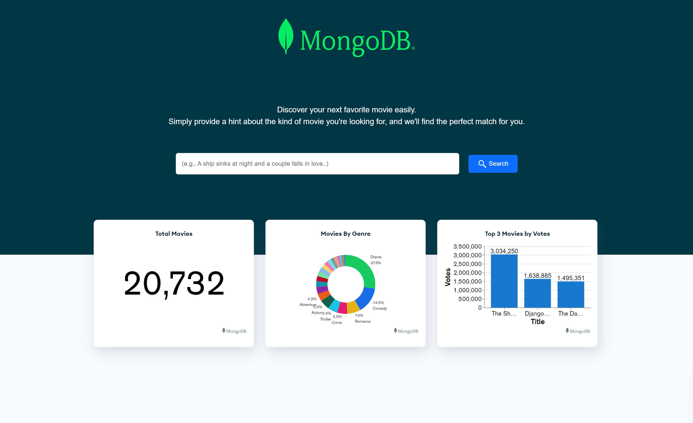
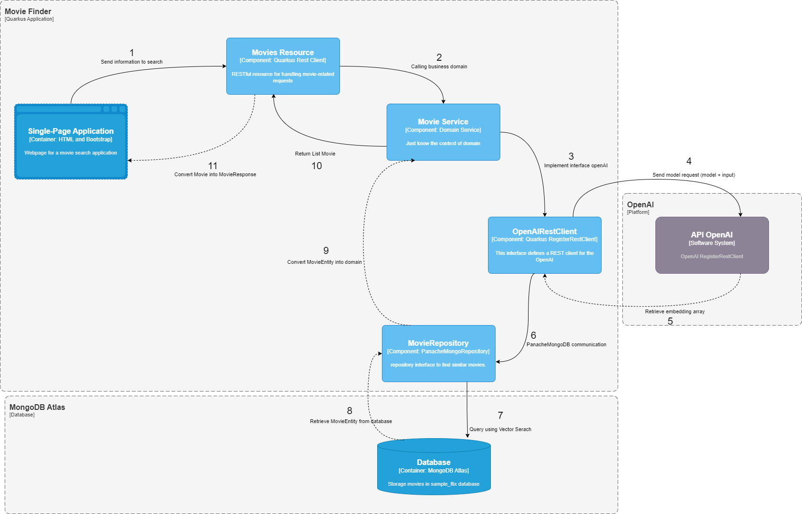

# Movie Finder

Welcome to Quarkus Movies Vector Search, a robust application engineered to revolutionize the way we discover movies. Utilizing the power of vector search in MongoDB Atlas, our application transforms the movie discovery experience into an intuitive, efficient, and enjoyable process.

Designed for avid movie enthusiasts, Quarkus Movies Vector Search untangles the complex web of movie metadata, harnessing the power of high-dimensional vectors to find the movies you'll love efficiently. Whether you're seeking something specific or just browsing, our vector-powered search engine delivers precise results in lightning speed.

This innovative application reflects our commitment to leverage state-of-art technology for better user experience. Unique in its adoption of vector search for movies, Quarkus Movies Vector Search sets the benchmark for future developments in movie discovery platforms.

## Demonstration

## Built With

- [Java](https://www.java.com/)
- [Quarkus](https://quarkus.io/)
- [MongoDB](https://www.mongodb.com/)

## Architecture

## Application Diagram

